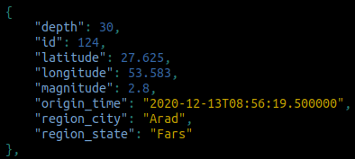

## [IRAN EARTHQUAKE API](http://irsc.ut.ac.ir/)

#### End Points
| **Use Case**                            | **End Point**                                                                                                   |
|:----------------------------------------|:----------------------------------------------------------------------------------------------------------------|
|All EarthQuakes                          | `/api/all/`                                                                                                     |
|Last n EarthQuakes                       | `/api/last/n/`                                                                                                  |
|EarthQuake with Magnitude greater than m | `/api/magnitude_gte/m/`                                                                                         

### Insatlling
>Requires the Python3.5+ interpreter, and pipenv.

  1 - clone repo :)

        `git clone https://github.com/AMIRHUSAINZAREI/Iran-earthquake-api`

        `cd Iran_earthquake_api`
  
  2 - start pipenv and install dependency

        `pipenv shell`

        `pipenv install -r requirments.txt`

  3 - run

        `python manage.py runserver`

I'm a tourist in computer vast world and Django is my friend and vehicle, this project seems like one of the first cites that i visited and enjoyed and learn a lot.
